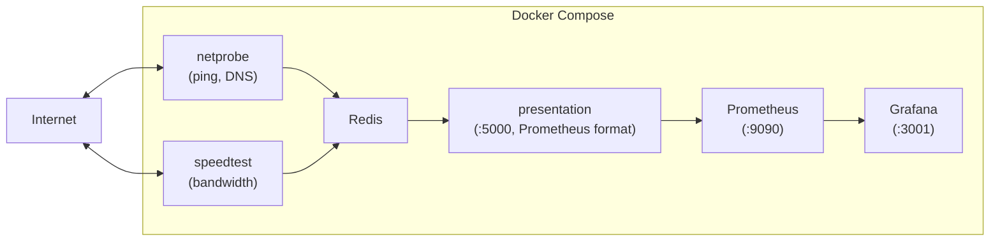

# Netprobe Lite

Simple and effective tool for measuring ISP performance at home. Netprobe measures several key metrics including packet loss, latency, jitter, and DNS performance, with an optional speed test for bandwidth measurement. These metrics are aggregated into an overall Internet Quality Score that you can monitor over time through a Grafana dashboard.

## Table of Contents

- [Architecture](#architecture)
- [Requirements](#requirements)
- [Quick Start](#quick-start)
- [Installation](#installation)
  - [First-time Install](#first-time-install)
  - [Upgrading Between Versions](#upgrading-between-versions)
- [Configuration](#configuration)
  - [Environment Variables Reference](#environment-variables-reference)
  - [Enable Speedtest](#enable-speedtest)
  - [Change Grafana Port](#change-grafana-port)
  - [Customize DNS Test](#customize-dns-test)
  - [Use External Grafana](#use-external-grafana)
  - [Health Score Weights and Thresholds](#health-score-weights-and-thresholds)
- [Data Storage](#data-storage)
  - [Default (Docker Volumes)](#default-docker-volumes)
  - [Bind Mount Method](#bind-mount-method)
- [Run on Startup](#run-on-startup)
- [Developers](#developers)
  - [Building and Publishing Multi-Arch Images](#building-and-publishing-multi-arch-images)
- [Portainer Deployment](#portainer-deployment)
- [FAQ and Troubleshooting](#faq-and-troubleshooting)
- [Support the Project](#support-the-project)
- [License](#license)

## Architecture

Netprobe Lite consists of six services orchestrated via Docker Compose:



- **netprobe** -- runs ping, traceroute, and DNS resolution tests on a 30-second interval.
- **speedtest** -- runs an optional bandwidth test via speedtest.net.
- **Redis** -- stores the latest probe results.
- **presentation** -- reads results from Redis and exposes them as Prometheus metrics on port 5000.
- **Prometheus** -- scrapes the presentation service and stores time-series data.
- **Grafana** -- visualizes the data on a pre-configured dashboard (exposed on port 3001).

## Requirements

- Docker Engine with the Compose V2 plugin (`docker compose`).
- A machine with a wired Ethernet connection to your primary ISP router, to ensure tests accurately measure ISP performance excluding any interference from your home Wi-Fi network. An old PC running Linux works well for this.

## Quick Start

1. Clone the repository:

```shell
git clone https://github.com/plaintextpackets/netprobe_lite.git
cd netprobe_lite
```

2. Start all services:

```shell
docker compose -f docker-compose.yml -f example.docker-compose.override.yml up --build -d
```

3. Open Grafana at `http://<probe-ip>:3001/d/app/netprobe`. Default credentials are `admin` / `admin`.

## Installation

### First-time Install

1. Clone the repo locally to the probe machine:

```shell
git clone https://github.com/plaintextpackets/netprobe_lite.git
cd netprobe_lite
```

2. Use Docker Compose to launch the app:

```shell
docker compose -f docker-compose.yml -f example.docker-compose.override.yml up --build -d
```

3. To shut down the app:

```shell
docker compose down
```

### Upgrading Between Versions

When upgrading between versions, it is best to delete the deployment altogether and restart with the new code.

1. Stop Netprobe and use the `-v` flag to delete all volumes (warning: this deletes old data):

```shell
docker compose down -v
```

2. Pull the latest code (or download manually from GitHub and replace the current files):

```shell
git pull
```

3. Re-start Netprobe:

```shell
docker compose -f docker-compose.yml -f example.docker-compose.override.yml up --build -d
```

## Configuration

All configuration is done through the `.env` file (and optionally a `custom.env` override file loaded via `docker-compose.override.yml`). Do not change any variable names.

### Environment Variables Reference

#### Site and DNS Settings

| Variable | Default | Description |
|---|---|---|
| `SITES` | `"google.com,facebook.com,twitter.com,youtube.com,amazon.com"` | Comma-separated list of sites to ping (max 5) |
| `DNS_TEST_SITE` | `"google.com"` | Domain used for DNS resolution tests |
| `DNS_NAMESERVER_1` | `"Google_DNS"` | Label for DNS server 1 |
| `DNS_NAMESERVER_1_IP` | `"8.8.8.8"` | IP for DNS server 1 |
| `DNS_NAMESERVER_2` | `"Quad9_DNS"` | Label for DNS server 2 |
| `DNS_NAMESERVER_2_IP` | `"9.9.9.9"` | IP for DNS server 2 |
| `DNS_NAMESERVER_3` | `"CloudFlare_DNS"` | Label for DNS server 3 |
| `DNS_NAMESERVER_3_IP` | `"1.1.1.1"` | IP for DNS server 3 |
| `DNS_NAMESERVER_4` | `"My_DNS_Server"` | Label for DNS server 4 (do not change) |
| `DNS_NAMESERVER_4_IP` | `"8.8.8.8"` | IP for DNS server 4 (replace with your home DNS server) |

#### Speedtest Settings

| Variable | Default | Description |
|---|---|---|
| `SPEEDTEST_ENABLED` | `"False"` | Set to `"True"` to enable bandwidth testing |
| `SPEEDTEST_INTERVAL` | `"937"` | Interval in seconds between speed tests (prime number reduces collisions) |

#### Health Score Weights

Must add up to `1.0`.

| Variable | Default | Description |
|---|---|---|
| `weight_loss` | `".6"` | Packet loss weight (60%) |
| `weight_latency` | `".15"` | Latency weight (15%) |
| `weight_jitter` | `".2"` | Jitter weight (20%) |
| `weight_dns_latency` | `"0.05"` | DNS latency weight (5%) |

#### Health Score Thresholds

| Variable | Default | Description |
|---|---|---|
| `threshold_loss` | `"5"` | Max packet loss percentage |
| `threshold_latency` | `"100"` | Max latency in ms |
| `threshold_jitter` | `"30"` | Max jitter in ms |
| `threshold_dns_latency` | `"100"` | Max DNS latency in ms |

#### System Variables (do not modify)

| Variable | Default | Description |
|---|---|---|
| `PRESENTATION_PORT` | `"5000"` | Port the presentation service listens on |
| `PRESENTATION_INTERFACE` | `"0.0.0.0"` | Interface the presentation service binds to |
| `REDIS_URL` | `"netprobe-redis"` | Redis hostname (Docker service name) |
| `REDIS_PORT` | `"6379"` | Redis port |
| `REDIS_PASSWORD` | `"password"` | Redis password |
| `PROBE_INTERVAL` | `"30"` | Seconds between probe cycles |
| `PROBE_COUNT` | `"10"` | Number of ping packets per probe cycle |

#### Path Variables

| Variable | Default | Description |
|---|---|---|
| `CONFIG_PATH` | `./config` | Path to configuration files |
| `DATA_PATH` | `./data` | Path to data directory |
| `LOGS_PATH` | `./logs` | Path to log files |

### Enable Speedtest

By default the speed test feature is disabled, as many users pay for bandwidth usage (e.g. cellular connections). To enable it, edit the `.env` file:

```shell
SPEEDTEST_ENABLED="True"
```

Note: speedtest.net limits how frequently you can run tests. Setting the interval too low will cause errors. It is recommended to leave `SPEEDTEST_INTERVAL` at its default value of 937 seconds.

### Change Grafana Port

To change the port Grafana is accessible on, edit `docker-compose.yml` under the `grafana` section:

```yaml
ports:
  - '3001:3000'
```

Change `3001` to the port you want to use on the host.

### Customize DNS Test

If the DNS server your network uses is not already monitored, you can add its IP for testing. Modify this line in `.env`:

```shell
DNS_NAMESERVER_4_IP="8.8.8.8" # Replace this IP with the DNS server you use at home
```

Change `8.8.8.8` to the IP of the DNS server you use, then restart the application (`docker compose down` / `docker compose up`).

### Use External Grafana

If you have your own Grafana instance and want to ingest Netprobe metrics there instead of running Grafana in Docker:

1. In `docker-compose.yml`, add a port mapping to the Prometheus service:

```yaml
prometheus:
  ...
  ports:
    - 'XXXX:9090'
```

Replace `XXXX` with the port you want to expose Prometheus on your host machine.

2. Remove the Grafana service from `docker-compose.yml`.

3. Run Netprobe and add a datasource in your existing Grafana pointing to `http://<probe-ip>:XXXX`.

### Health Score Weights and Thresholds

The Internet Quality Score is calculated using weighted metrics. You can adjust the weights in `.env` (they must add up to `1.0`):

```shell
weight_loss = ".6"         # Loss is 60% of score
weight_latency = ".15"     # Latency is 15% of score
weight_jitter = ".2"       # Jitter is 20% of score
weight_dns_latency = "0.05" # DNS latency is 5% of score
```

The thresholds define the maximum acceptable values for each metric:

```shell
threshold_loss = "5"            # 5% packet loss
threshold_latency = "100"       # 100ms latency
threshold_jitter = "30"         # 30ms jitter
threshold_dns_latency = "100"   # 100ms DNS latency
```

## Data Storage

### Default (Docker Volumes)

By default, Docker stores collected data in named volumes that persist between restarts:

- `netprobe_prometheus_data` -- Prometheus time-series data
- `netprobe_grafana_data` -- Grafana configuration and credentials

To clear all stored data:

```shell
docker compose down
docker volume rm netprobe_grafana_data
docker volume rm netprobe_prometheus_data
```

Or remove everything at once:

```shell
docker compose down -v
```

### Bind Mount Method

If you prefer storing data in host directories instead of Docker volumes (credit: @Jeppedy):

1. Clone the repo.

2. Create the data directories:

```shell
mkdir -p data/grafana data/prometheus
```

3. Modify `docker-compose.yml` to use bind mounts and set the user ID:

```yaml
prometheus:
  restart: always
  container_name: netprobe-prometheus
  image: "prom/prometheus"
  volumes:
    - ./config/prometheus/prometheus.yml:/etc/prometheus/prometheus.yml
    - ./data/prometheus:/prometheus
  command:
    - '--config.file=/etc/prometheus/prometheus.yml'
    - '--storage.tsdb.path=/prometheus'
  networks:
    - netprobe-net
  user: "1000" # set to user with correct permissions

grafana:
  restart: always
  image: grafana/grafana-enterprise
  container_name: netprobe-grafana
  volumes:
    - ./config/grafana/datasources/automatic.yml:/etc/grafana/provisioning/datasources/automatic.yml
    - ./config/grafana/dashboards/main.yml:/etc/grafana/provisioning/dashboards/main.yml
    - ./config/grafana/dashboards/netprobe.json:/var/lib/grafana/dashboards/netprobe.json
    - ./data/grafana:/var/lib/grafana
  ports:
    - '3001:3000'
  networks:
    - netprobe-net
  user: "1000" # set to user with correct permissions
```

4. Remove the top-level `volumes:` section from `docker-compose.yml`.

## Run on Startup

Netprobe automatically restarts after a host reboot, provided Docker is also configured to start on boot. To disable this behavior, change the `restart` policy in `docker-compose.yml`:

```yaml
restart: "no"
```

## Developers

### Building and Publishing Multi-Arch Images

The project supports building images for `amd64`, `arm32v7`, and `arm64v8` architectures. The Dockerfile uses the official multi-arch `python:` base image, and the correct platform is selected via the `--platform` flag.

1. Edit `build.env` with your Docker registry info:

```shell
export DOCKER_REGISTRY=xian55/netprobe_lite
export PYTHON_VERSION=3.12
```

2. Source the environment and run the build script:

```shell
source build.env
./build_publish.sh
```

3. Make sure you are logged in to Docker Hub first (`docker login`).

The script builds each architecture, pushes the individual images, creates a multi-arch manifest, and publishes it with the `latest` tag.

## Portainer Deployment

1. Clone the repo to a path on your host (e.g. `/project/`).
2. Navigate to Portainer.
3. Open Stacks.
4. Click "Add Stack".
5. Choose Web Editor. Since `docker-compose.override.yml` is not supported in Portainer, paste the following compose configuration directly:

```yaml
# Docker compose file for netprobe
# https://github.com/xian55/netprobe_lite
name: netprobe

networks:
  netprobe-net:

services:
  redis:
    restart: always
    container_name: netprobe-redis
    image: "redis:latest"
    volumes:
      - /{REPLACE_ME}/config/redis/:/etc/redis/
      - /{REPLACE_ME}/logs:/logs
    networks:
      - netprobe-net
    env_file:
      - stack.env
    dns:
      - 8.8.8.8
      - 8.8.4.4

  netprobe:
    restart: always
    container_name: netprobe-probe
    image: "${DOCKER_REGISTRY}:latest"
    environment:
      MODULE: "NETPROBE"
    volumes:
      - /{REPLACE_ME}/logs:/logs
    env_file:
      - stack.env
    networks:
      - netprobe-net
    dns:
      - 8.8.8.8
      - 8.8.4.4

  speedtest:
    restart: on-failure
    container_name: netprobe-speedtest
    image: "${DOCKER_REGISTRY}:latest"
    environment:
      MODULE: "SPEEDTEST"
    env_file:
      - stack.env
    volumes:
      - /{REPLACE_ME}/logs:/logs
    networks:
      - netprobe-net
    dns:
      - 8.8.8.8
      - 8.8.4.4

  presentation:
    restart: always
    container_name: netprobe-presentation
    image: "${DOCKER_REGISTRY}:latest"
    environment:
      MODULE: "PRESENTATION"
    env_file:
      - stack.env
    networks:
      - netprobe-net
    volumes:
      - /{REPLACE_ME}/logs:/logs
    dns:
      - 8.8.8.8
      - 8.8.4.4

  prometheus:
    restart: always
    container_name: netprobe-prometheus
    image: "prom/prometheus"
    env_file:
      - stack.env
    volumes:
      - /{REPLACE_ME}/logs:/logs
      - /{REPLACE_ME}/config/prometheus/:/etc/prometheus/
      - prometheus_data:/prometheus
    command:
      - '--config.file=/etc/prometheus/prometheus.yml'
      - '--storage.tsdb.path=/prometheus'
    networks:
      - netprobe-net
    dns:
      - 8.8.8.8
      - 8.8.4.4

  grafana:
    restart: always
    image: grafana/grafana-enterprise
    container_name: netprobe-grafana
    env_file:
      - stack.env
    volumes:
      - /{REPLACE_ME}/logs:/logs
      - /{REPLACE_ME}/config/grafana/datasources/:/etc/grafana/provisioning/datasources/
      - /{REPLACE_ME}/config/grafana/dashboards/:/etc/grafana/provisioning/dashboards/
      - /{REPLACE_ME}/config/grafana/dashboards/:/var/lib/grafana/dashboards/
      - grafana_data:/var/lib/grafana
    ports:
      - '3001:3000'
    networks:
      - netprobe-net
    dns:
      - 8.8.8.8
      - 8.8.4.4

volumes:
  prometheus_data:
  grafana_data:
```

6. Set `env_file` to `stack.env` on each service -- this is how environment variables are passed to containers in Portainer.
7. Replace `/{REPLACE_ME}/config` and `/{REPLACE_ME}/logs` with actual paths on your host (e.g. `/project/config` and `/project/logs`).
8. Load the `.env` file using the "Load variables from .env file" button.
9. Optionally create a `custom.env` file with any overrides you wish to make, and load it the same way.
10. Review the loaded environment variables. If `custom.env` duplicated keys you want to override, delete the original keys so only the override values remain.
11. Press "Update the stack". The containers should come online.

## FAQ and Troubleshooting

**Q: How do I access the dashboard?**

Navigate to `http://<probe-ip>:3001/d/app/netprobe`. Default credentials are `admin` / `admin`. You will be prompted to set a new password on first login.

**Q: How do I reset my Grafana password?**

Delete the Grafana Docker volume. This resets credentials but preserves your Prometheus data:

```shell
docker volume rm netprobe_grafana_data
```

**Q: I am running Pi-hole and when I enter my host IP under `DNS_NAMESERVER_4_IP` I get this error:**

```
The resolution lifetime expired after 5.138 seconds: Server Do53:192.168.0.91@53
answered got a response from ('172.21.0.1', 53) instead of ('192.168.0.91', 53)
```

This is a limitation of Docker networking. If you are running another DNS server in Docker and want to test it in Netprobe, you need to use the Docker network gateway IP:

1. Stop Netprobe (do not wipe data): `docker compose down`
2. Find the gateway IP of the netprobe-probe container:

```shell
docker inspect netprobe-probe | grep Gateway
```

Example output:

```
"Gateway": "192.168.208.1",
```

3. Enter that gateway IP into `.env` for `DNS_NAMESERVER_4_IP` and restart Netprobe.

**Q: I constantly see one of my DNS servers at 5s latency. Is this normal?**

5 seconds is the timeout for DNS queries in Netprobe Lite. If you consistently see this for a specific server, your machine is likely having trouble reaching that DNS server and you should avoid using it for home DNS.

**Q: How do I wipe all stored data?**

```shell
docker compose down -v
```

This deletes all containers and volumes related to Netprobe.

## Support the Project

If you'd like to support the development of this project, feel free to buy me a coffee:

https://buymeacoffee.com/plaintextpm

Full video tutorial on how to install and use Netprobe:

https://youtu.be/Wn31husi6tc

## License

This project is released under a custom license that restricts commercial use. You are free to use, modify, and distribute the software for non-commercial purposes. Commercial use of this software is strictly prohibited without prior permission. If you have any questions or wish to use this software commercially, please contact [plaintextpackets@gmail.com].
